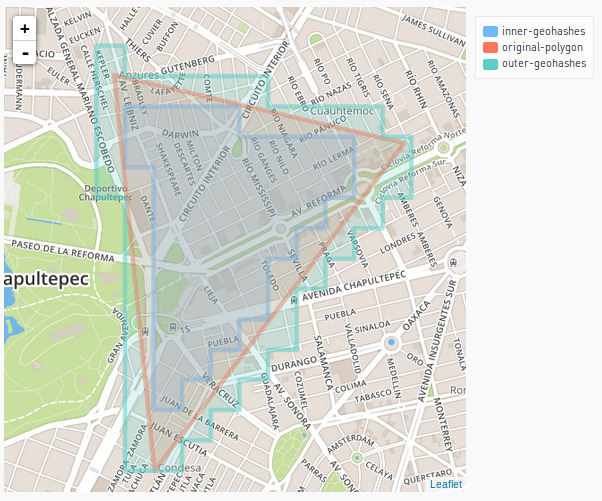

# polygon-geohasher
Polygon Geohasher is a Open source Python package which converts a
polygon into a set of geohashes with arbitrary precision. More
conversely, it can obtain the set of geohashes inside a polygon or
geohashes that touch (intersects) the polygon. This library uses
    [python-geohash](https://pypi.python.org/pypi/Geohash/) and
[shapely](http://toblerity.org/shapely/).


## Requirements
Polygon Geohasher requires:

- Python >= 3.x.
- GEOS >= 3.3 (due to shapely).

## Installing
Linux users can get Polygon Geohasher from the Python Package Index with
pip (8+):

`todo`
`$ pip install polygon-geohasher`

## Usage
Here are some simple examples:

```python
from shapely import geometry

polygon = geometry.Polygon([(-99.1795917, 19.432134), (-99.1656847, 19.429034),
                            (-99.1776492, 19.414236), (-99.1795917, 19.432134)])
inner_geohashes_polygon = geohashes_to_polygon(polygon_to_geohashes(test_polygon, 7))
outer_geohashes_polygon = geohashes_to_polygon(polygon_to_geohashes(test_polygon, 7, False))
```


`geohash_to_polygon(geohash)`:

This function receives a geohash, and returns a Shapely's Polygon.

`geohashes_to_polygon(geohashes)`:

This function receives a set of geohashes, and returns a Shapely's Polygon or MultiPolygon.


`polygon_to_geohashes(polygon, precision, inner(optional))`:

This function receives a Shapely's Polygon, the precision of geohashes that
will be used to create a polygon and returns a set of geohashes
(strings) which covers the polygon. It also receives an optional
parameter `inner` that defines the way how those polygons will be created.
If inner only contained geohashes will be used, otherwise intersected will.

For instance you can see resulted geohashed polygons with both options.



#### Donations

If you want to make any donation you can send to:

- [BTC](bitcoin.org): 1H6VrFKCEabn3rbE9JJUSRXB7PU8Bm4SND
- [BCC](bitcoincash.org): 1CmuSwFD9qghEfJ4DdSiRWLxfvK5Srfqsg