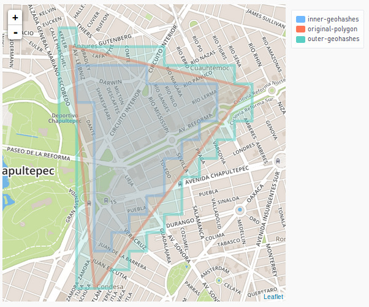

# polygon-geohasher
Polygon Geohasher is an open source Python package for converting Shapely's
polygons into a set of geohashes. It obtains the set of geohashes
inside a polygon or geohashes that touch (intersect) the polygon. This library uses
    [python-geohash](https://pypi.python.org/pypi/Geohash/) and
[shapely](http://toblerity.org/shapely/).


## Requirements
Polygon Geohasher requires:

- Python >= 3.x.
- GEOS >= 3.3 (due to shapely).

## Installing
Linux users can get Polygon Geohasher from the Python Package Index with
pip (8+):

`$ pip install polygon-geohasher`

## Usage
Here are some simple examples:

```python
from polygon_geohasher import polygon_to_geohashes, geohashes_to_polygon
from shapely import geometry

polygon = geometry.Polygon([(-99.1795917, 19.432134), (-99.1656847, 19.429034),
                            (-99.1776492, 19.414236), (-99.1795917, 19.432134)])
inner_geohashes_polygon = geohashes_to_polygon(polygon_to_geohashes(polygon, 7))
outer_geohashes_polygon = geohashes_to_polygon(polygon_to_geohashes(polygon, 7, False))
```

## Algorithm
`polygon_to_geohashes` uses a hierarchical geohash cover. It starts with a coarse
precision cover of the polygon bounds, discards cells that do not intersect the
polygon, and only subdivides boundary cells until the target precision. Cells
that are fully contained are expanded directly to the target precision without
additional geometry checks. This keeps work closer to boundary complexity than
to the full bounding box.

## Benchmarking
Compare the optimized implementation against the legacy algorithm:

`$ .venv/bin/python benchmarks/polygon_to_geohashes.py --iterations 5 --precision 7`

Use `--inner` or `--outer` to focus on a single mode, and `--no-validate` to skip
output validation.


`geohash_to_polygon(geohash)`:

This function receives a geohash and returns a Shapely's Polygon.

`geohashes_to_polygon(geohashes)`:

This function receives a set of geohashes and returns a Shapely's Polygon or MultiPolygon.


`polygon_to_geohashes(polygon, precision[, inner=True])`:

This function receives a Shapely's Polygon and the precision of geohashes 
to be used to create a polygon and returns a set of geohashes
(strings) that covers said polygon. It also receives an optional
parameter `inner` that defines the way in which those polygons will be created.
If an `inner` parameter is given, then only contained geohashes will be used; otherwise, 
intersected geohashes will be used.

See geohashed polygons resulting from both options (with and without `inner`) in the 
following example:


